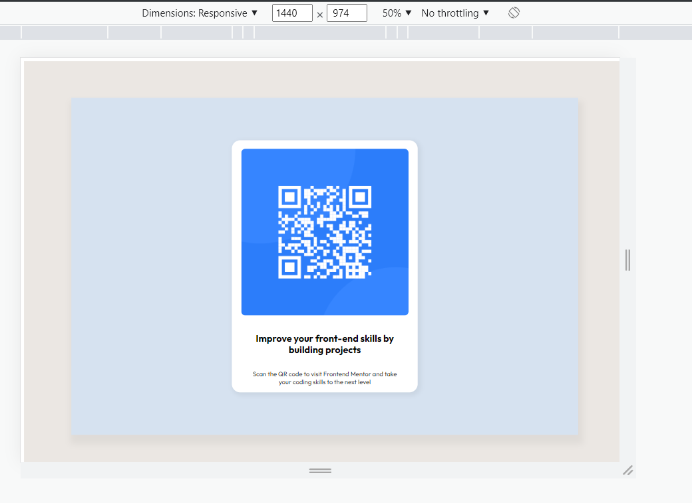
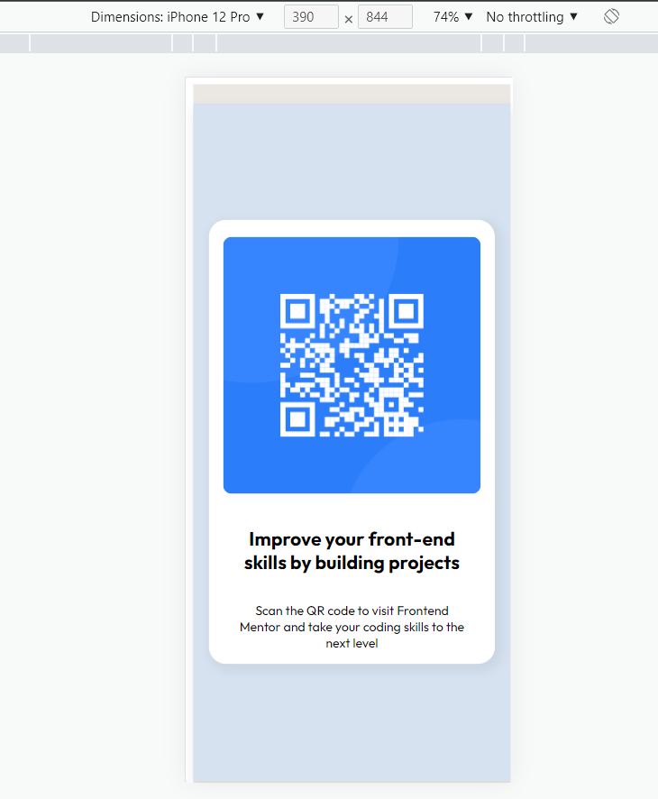

# Make It Real - QR code component

This is a solution to the third HTML/CSS project of the Make It Real course.

## Table of contents

- [Overview](#overview)
  - [The challenge](#the-challenge)
  - [Solution Screenshot](#Solution-Screenshot)
- [My process](#my-process)
  - [Built with](#built-with)
  - [What I learned](#what-i-learned)
  - [Continued development](#continued-development)
  - [Useful resources](#useful-resources)
- [Author](#author)
- [Acknowledgments](#acknowledgments)

## Overview

### The challenge

Users should be able to:

- Design a QR code card as close as the screenshot picture of the project.

### Solution Screenshot




## My process

### Built with

- CSS custom properties
- Flexbox
- Media Queries (Breakpoint 500px, 800px)
- Boxshadow property

### What I learned

We learned how to use properties such as Boxshadow for visual effects inclusion.

```css
#background {
  box-shadow: 4px 15px 15px 7px rgb(0 0 0 / 5%);
}
```

### Continued development

It will be nice to use Grid to create the same layout.

### Useful resources

- [Flexbox tutorial](https://www.youtube.com/watch?v=tXIhdp5R7sc) - This helped me figuring out how to use Flexbox properties.
- [Media queries](https://youtu.be/sd16e11blHI) - This is an amazing tutorial for media queries basic concepts.
- [Boxshadow property](https://youtu.be/1aIcnXaEjmQ) - This is an amazing tutorial for Boxshadow property basic concepts.

## Author

- Github - [Juan Velasco](https://github.com/juandiegovelsol)
- Github - [Ivan Cabulo](https://github.com/icabulo)

## Acknowledgments

Kudos to our friends and mentors: Sergio Jaramilo and Daniel Espitia.
